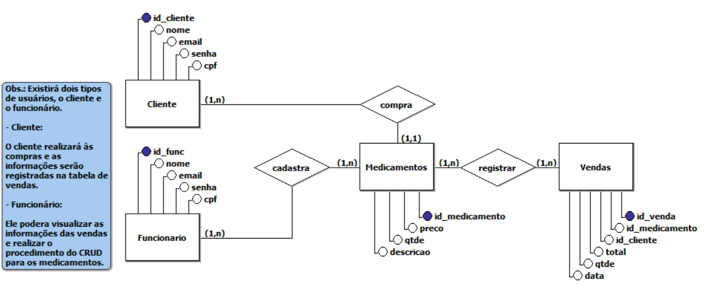

# Projeto de administração de um Sistema Farmacêutico
Repositório destinado para a avaliação somativa sobre administração de farmácia com o Framework Laravel.

>  ## _índice:_

- [Introdução](#introdução);
- [Objetivos do Projeto](#objetivos-do-projeto);
- [Funcionalidades](#funcionalidades);
- [Testes e Resultados](#testes-e-resultados);
- [Designs e Estilos](#designs-e-estilos);
- [Banco de Dados](#banco-de-dados);
- [Estrutura de Programação](#estrutura-de-programação);

>  ## _Introdução_
No cenário atual das farmácias, a gestão eficiente de medicamentos, aliada ao atendimento ágil e seguro dos clientes, é essencial para garantir a qualidade dos serviços oferecidos. Com o avanço da tecnologia, a necessidade de sistemas automatizados que possam otimizar essas operações se tornou evidente.

Este projeto tem como objetivo desenvolver um sistema farmacêutico robusto e intuitivo, voltado para a melhoria das operações diárias em farmácias. O sistema permitirá o gerenciamento eficaz de medicamentos, o registro detalhado de vendas, e a administração segura de dados de clientes e funcionários.

Com foco em facilitar a vida tanto dos profissionais que atuam nas farmácias quanto dos clientes, este projeto visa criar uma solução que não apenas automatize processos, mas também garanta a segurança e a eficiência em todas as etapas de atendimento.

O público-alvo deste sistema inclui farmacêuticos, funcionários administrativos, e clientes que buscam um serviço ágil e confiável. A implementação deste sistema proporcionará uma experiência mais eficiente e segura, refletindo diretamente na satisfação dos usuários e na melhoria da gestão interna das farmácia
 
> ## _Objetivos do Projeto_
Os principais objetivos desse sistema, são:  
**1. Específicos:**
- Automatizar a gestão de medicamentos.
- Facilitar o processo de compra e venda.
- Prover um sistema seguro de gerenciamento de dados de clientes e funcionários.
 

**2. Mensuráveis:**
- Reduzir o tempo de atendimento em 100%.
- Diminuir erros na venda de medicamentos em 100%.
 

**3. Atingíveis:**
- O projeto será implementado em fases, garantindo que cada etapa seja concluída dentro do cronograma.
 

**4. Relevantes:**
- O sistema será essencial para melhorar a precisão e segurança na gestão farmacêutica.
 

**5. Temporais:**
- O projeto será concluído em 3 meses, com entregas parciais a cada fase de desenvolvimento.

 

> ## _Funcionalidades_
As principais funcionalidades desse sistema, são:
- Gestão de Medicamentos: Cadastro, atualização, e controle de estoque.
- Registro de Vendas: Controle de transações, histórico de compras, e geração de recibos.
- Cadastro de Clientes e Funcionários: Gestão de perfis com segurança e privacidade.
- Relatórios: Geração de relatórios para análise de vendas, estoque, e performance.

 

### _Manual de Instrução:_
  
 

> ## _Testes e Resultados_

 

> ## _Designs e Estilos_

 

> ## _Banco de Dados_
Imagem do Diagrama conceitual:

    

 

### _Tabelas e Elementos:_

**Tabela: Cliente**
- id_cliente (Chave Primária)
- nome
- email
- senha
- cpf

**Tabela: Funcionário**
- id_func (Chave Primária)
- nome
- email
- senha
- cpf

**Tabela: Medicamentos**
- id_medicamento (Chave Primária)
- preco
- qtde (quantidade)
- descricao

**Tabela: Vendas**
- id_venda (Chave Primária)
- id_medicamento (Chave Estrangeira referenciando Medicamentos)
- id_cliente (Chave Estrangeira referenciando Cliente)
- total
- qtde (quantidade)
- data
-  

### _Relações:_
- Cliente e Vendas: Um cliente pode realizar várias vendas (relação 1).
- Funcionário e Medicamentos: Um funcionário pode cadastrar vários medicamentos (relação 1).
- Medicamentos e Vendas: Um medicamento pode estar relacionado a várias vendas (relação 1).

 

> ## _Análise de riscos_
Aqui estão alguns possíveis problemas que podem ocorrer durante o projeto:  
**1. Falhas no Sistema de Autenticação:**
- Descrição: Possibilidade de vulnerabilidades no sistema de login e autenticação que possam permitir o acesso não autorizado.
- Impacto: Acesso indevido a informações sensíveis de clientes e funcionários, comprometendo a segurança dos dados.
- Mitigação: Implementação de autenticação multifator (MFA) e criptografia robusta para senhas.
 

**2. Perda ou Corrupção de Dados:**
- Descrição: Possibilidade de perda ou corrupção de dados críticos devido a falhas no banco de dados ou problemas no servidor.
- Impacto: Perda irreparável de informações sobre medicamentos, clientes, e vendas, afetando a operação da farmácia.
- Mitigação: Realização de backups regulares e implementação de mecanismos de recuperação de desastres.
 

**3. Ataques de SQL Injection:**
- Descrição: Risco de ataques de injeção de SQL, onde um invasor pode manipular consultas SQL para obter acesso não autorizado ao banco de dados.
- Impacto: Comprometimento do banco de dados, resultando na exposição de dados confidenciais.
- Mitigação: Utilização de consultas parametrizadas e práticas seguras de codificação para prevenir SQL Injection.
 

**4. Falta de Escalabilidade do Sistema:**
- Descrição: O sistema pode não suportar um aumento significativo de usuários e transações.
- Impacto: Desempenho degradado, lentidão, e possíveis interrupções no serviço à medida que a farmácia cresce.
- Mitigação: Planejamento e arquitetura escalável desde o início, com uso de serviços de nuvem e balanceamento de carga.
 

**5. Problemas de Conformidade Legal:**
- Descrição: Risco de não conformidade com leis e regulamentos relacionados à privacidade e segurança de dados (como a LGPD).
- Impacto: Penalidades legais, multas, e danos à reputação da farmácia.
- Mitigação: Consulta com especialistas em conformidade e implementação de medidas para garantir que o sistema atenda a todos os requisitos legais.
 

**6. Dependência de Fornecedores Terceirizados:**
- Descrição: Dependência de serviços de terceiros, como provedores de hospedagem ou APIs externas, que podem ter interrupções ou falhas.
- Impacto: Interrupções no sistema ou perda de funcionalidade em caso de falhas do fornecedor.
- Mitigação: Acordos de nível de serviço (SLAs) rigorosos e planejamento de contingências, como backup de serviços.
 

**7. Erros Humanos:**
- Descrição: Risco de erros humanos na manipulação de dados, configuração do sistema, ou no desenvolvimento do código.
- Impacto: Falhas no sistema, perda de dados, ou introdução de vulnerabilidades de segurança.
- Mitigação: Treinamento adequado dos funcionários e implementação de processos de revisão e auditoria.

 

> ## _Estrutura de Programação_
**Framework Laravel**
 
O portal de empregos foi desenvolvido utilizando o framework Laravel, uma poderosa ferramenta baseada em PHP que permite o desenvolvimento de aplicações web de forma rápida e segura. Laravel oferece uma arquitetura bem estruturada e organizada, facilitando a implementação de funcionalidades complexas, como autenticação de usuários, gerenciamento de dados e integração com APIs. Suas características, como o sistema de rotas simples, a utilização de Eloquent ORM para manipulação de banco de dados e o suporte a migrações, fazem dele uma escolha ideal para projetos que demandam escalabilidade e segurança.

**Banco de Dados Postgresql**
 
Para o gerenciamento dos dados, optamos pelo PostgreSQL, um banco de dados relacional conhecido por sua robustez, desempenho e conformidade com o padrão SQL. PostgreSQL oferece suporte a transações complexas, integridade referencial e a capacidade de lidar com grandes volumes de dados, o que o torna perfeito para uma aplicação que precisa armazenar e gerenciar informações críticas, como perfis de candidatos, vagas de emprego, e dados empresariais. A combinação de Laravel com PostgreSQL garante que o sistema seja não apenas funcional, mas também seguro e eficiente.

**Bootstrap**
 
Bootstrap é um popular framework de front-end utilizado para criar interfaces web responsivas e modernas. Desenvolvido pela equipe do Twitter, ele oferece uma ampla gama de componentes prontos, como botões e formulários, além de um sistema de grid flexível que facilita o design para diferentes dispositivos.

**Github**
 
Além disso, utilizamos o Git como sistema de controle de versão, permitindo o armazenamento seguro de todos os arquivos do projeto e da documentação. O Git não só facilita a colaboração entre os membros da equipe, como também assegura que todas as mudanças no código sejam registradas e possam ser revertidas, se necessário, garantindo assim um desenvolvimento mais organizado e controlado.

